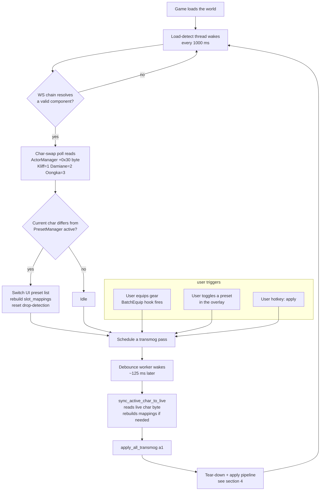
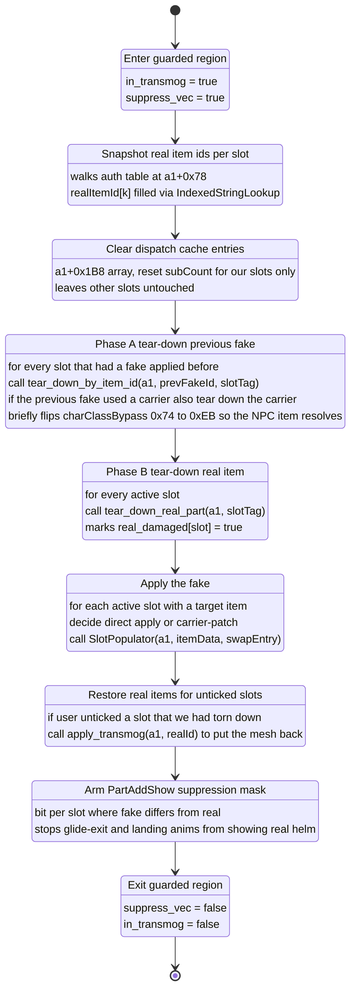
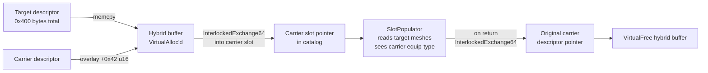

# Live Transmog -- Runtime Architecture

Reverse-engineering reference for the Live Transmog mod's runtime pipeline, verified against **Crimson Desert v1.03.01** (PC binary, image base `0x140000000`). This document maps the apply pipeline to concrete functions, offsets, and source locations; byte-level anchors (AOBs, struct offsets) live in `live-transmog-source-of-truth.md`.

---

## 1. Pipeline summary

The engine owns its own rules for which visual mesh is drawn per armor slot (helm, chest, cloak, gloves, boots). Live Transmog does not rewrite those rules. It operates by:

1. Asking the engine to remove the real armor's mesh from the live scene graph (SafeTearDown path).
2. Asking the engine to run its own "show this item" path (`SlotPopulator`) with a substituted item id.

The auth table at `a1+0x78` (what is actually equipped, and what is serialised to the save file) is never mutated. Mod state lives in DLL memory and is released on quit.

---

## 2. Terminology

| Term | Plain English | Technical meaning |
|------|---------------|-------------------|
| **Real item** | Whatever the character actually has equipped in the inventory screen. | Entry in the auth table at `a1+0x78`. Written to save file. |
| **Fake item** | The mesh the mod is asking the engine to draw instead. | `slot_mappings[i].targetItemId` in mod memory. Not persisted. |
| **Carrier** | Helper item the mod uses to pass the engine's class check. | Member of `k_kliffCarriers` / `k_oongkaCarriers` / `k_damianeCarriers`. |
| **Auth table** | Authoritative equipment record (server-synced). | Stride-`0xC8` array at `*(a1+0x78)+0x08`, count at `+0x10`. |
| **PartDef / scene graph cache** | Live in-RAM list of meshes the renderer walks this frame. | Dispatch cache at `a1+0x1B8` (ptr), `+0x1C0` (count), `+0x1C4` (cap). |
| **Tear-down** | Scene-graph remove ("stop drawing this mesh"). | Call path passing through `sub_14075F9E0` (internal label `SafeTearDown` at `+0x14075FE60`). |
| **a1** | Equip-wrapper pointer passed back into engine functions. | Player-component pointer; engine reads many offsets from it. |
| **Dispatch** | One full tear-down-and-reapply pass. | Body of `apply_all_transmog()` in `transmog_apply.cpp`. |

---

## 3. End-to-end lifecycle



Components:

- **Load-detect thread** (`transmog_worker.cpp :: load_detect_thread_fn`). Wakes once per second. Resolves the player component via the static `WS -> ActorManager -> UserActor -> +0xD8` chain, and reads the character-index byte to swap the active preset on in-game character switches.
- **Hooks** (`transmog_hooks.cpp`). Two apply triggers: `BatchEquip` at `+0x007605B0` and `VisualEquipChange (VEC)` at `+0x007733B0`. On fire, they record the passed-in `a1` and schedule a pass.
- **Debounce worker** (`transmog_worker.cpp :: run_debounced_apply`). Single thread consuming scheduled apply requests, coalescing bursts.

The rest of this document focuses on one apply pass (node `Y`).

---

## 4. One apply pass

`apply_all_transmog()` in `transmog_apply.cpp` executes as a short state machine:



The `__finally` around this state machine clears `in_transmog` and `suppress_vec` even if a step throws an SEH exception; without it, a fault would leave hooks gagged permanently and no further equip events would fire through the mod.

### 4.1 Phase A -- "forget the old fake"

When the mod applies a new preset, the previous preset is still on screen. Phase A walks the slots the mod wrote to last time (`last_applied_ids`) and asks the engine to remove those meshes from the scene graph:

```
tear_down_by_item_id(a1, prevFakeId, slotTag)
  -> IndexedStringLookup(&prevFakeId)           // descriptor hash
  -> SafeTearDown(a1, hash, slotTag)            // label at 0x14075FE60
                                                // (inside sub_14075F9E0)
       -> internal detach path at 0x1425EBAE0   // inside sub_1425EACA0
                                                // detaches mesh, particle
                                                // emitters, anim controllers
                                                // from the scene
```

No write to `a1+0x78` (auth table). No server-side notification. Save file bytes unchanged across the call. SafeTearDown is a scene-graph operation only -- it removes the mesh from the render list and drops the renderer's internal refs.

If the previous apply used a carrier, the mod briefly flips `charClassBypass` at `0x141D5F538` from `0x74` (`jz short`) to `0xEB` (`jmp short`) so the engine's class check accepts the NPC carrier during tear-down. The byte is restored to `0x74` the moment tear-down returns.

### 4.2 Phase B -- remove the real mesh so the fake can take its place

Phase B calls a different tear-down path that walks the auth table directly:

```
tear_down_real_part(a1, slotTag)
  -> container = *(a1 + 0x78)
  -> base     = *(container + 0x08)              // stride 0xC8 entries
  -> count    = *(container + 0x10)
  -> for i in 0..count
       -> entry = base + i * 0xC8
       -> if *(entry + 0xC0) == slotTag          // slot tag match
              realItemId = *(entry + 0x88)       // alt first
              if realItemId == 0xFFFF:
                  realItemId = *(entry + 0x08)   // fall back to primary
              -> IndexedStringLookup(&realItemId)
              -> SafeTearDown(a1, hash, slotTag)
```

1. The walk **reads** entries to find the real item id. It does not write to any entry.
2. Tear-down is a renderer-side operation. The engine's belief about what is equipped is unchanged.

After Phase B, `real_damaged[slotIdx] = true` records that the real mesh is currently missing from the scene graph. That flag is consulted in Restore if the user unticks a slot in the overlay.

### 4.3 Apply -- draw the fake mesh

For every active slot with a target item, the mod calls SlotPopulator (the same function the engine itself uses to attach armor). Two flavours:

**Direct apply** when the fake is something the active character can normally wear:

```
apply_transmog(a1, targetItemId)
  itemData = { word targetId at +0, defaults elsewhere }
  swapEntry = zero-initialised via InitSwapEntry
  SlotPopulator(a1, &itemData, &swapEntry)
```

**Carrier-patch apply** when the fake belongs to another character or an NPC. The engine's equip gate checks a `u16` at `desc+0x42` (equip-type, `0x0004` for Kliff, `0x0001` for Oongka/Damiane/NPCs). If the fake's byte does not match the active character's expected value, direct apply is rejected. The mod builds a hybrid descriptor:



Exactly one field is patched: the equip-type at `+0x42`. Every other byte in the hybrid comes from the target (meshes, textures, tints, rule classifiers). SlotPopulator reads the patched byte during its visual-config matching loop (label `+0x14076CAED` inside `sub_14076C7F0`), accepts the carrier's class identity, then renders the target's visual data.

During the call, the `charClassBypass` byte is again flipped to `0xEB` so any deeper class check also passes. Bypass and descriptor pointer are both restored inside a `__finally` so an SEH fault cannot leave the catalog corrupted. The hybrid buffer is freed immediately after.

Source: `CrimsonDesertLiveTransmog/src/transmog_apply.cpp` (`k_descBufSize = 0x400` constant, `charClassBypass` flip at line ~359 and ~507; hybrid assembly around lines ~320--342).

### 4.4 Restore -- put the real item back if the user unticked

If the user turns off a slot in the overlay, the mod needs to put the real mesh back. This is a SlotPopulator call with the real item id the mod snapshotted during the real-id sweep at the top of the dispatch.

### 4.5 PartAddShow suppression

The engine occasionally bypasses the regular scene-graph path and calls `PartAddShow` directly, most notably during glide exits, horse dismounts, and some action-chart landings. If that happens while the mod has torn down the real mesh, the real helm flashes visible for a frame or two. The mod hooks PartAddShow and keeps a small table of suppressed part hashes; while a slot is in the torn-down state, any add-show call for one of that slot's part hashes returns zero immediately without touching the scene graph.

Source: `CrimsonDesertLiveTransmog/src/part_show_suppress.cpp`.

---

## 5. Memory write surface

Every absolute write the mod performs:

| Address | Size | Frequency | Reason | Restore |
|---------|------|-----------|--------|---------|
| `0x141D5F538` | 1 byte | during carrier-apply / tear-down | Flip `JZ` (`0x74`) to `JMP` (`0xEB`) so NPC carriers pass the class check | Restored within the same function under `__finally` |
| `a1 +0x1B8..+0x1C4` (dispatch cache) | ~16 bytes per slot | during apply | Invalidate stale cache entries for mod-owned slots | Natural overwrite by SlotPopulator on the next apply |
| Mod-allocated heap buffer (`VirtualAlloc`) | `0x400` bytes per carrier apply | during carrier-apply | Build hybrid descriptor | Freed via `VirtualFree` before the function returns |
| Carrier slot pointer in item catalog | 8 bytes via `InterlockedExchange64` | during carrier-apply | Redirect catalog lookup to the hybrid for one call | Swapped back to original within the same function under `__finally` |

No writes to the auth table at `a1+0x78` or its entries. No writes to save-file-backed state. On DLL unload, all mod-side arrays are released; the hybrid buffer is freed; `charClassBypass` is `0x74` because every flip is paired with a restore in a `__finally`.

---

## 6. Event-driven state transitions

| Event | What the mod sees | Mod response |
|-------|-------------------|--------------|
| Zone transition | `BatchEquip` hook fires with a different `a1`. | Wipes `real_damaged` and `last_applied_real_ids` (arrays referenced previous world's memory). Schedules a fresh dispatch. |
| Save-load | Same as zone transition. Server resends auth table, BatchEquip fires, mod re-applies. | Preset file unchanged. Real gear unchanged. Fake gear re-applies within a second. |
| Character control swap (Kliff -> Damiane) | Load-detect thread reads a different value from `ActorManager + 0x30`. The controlled actor at `UserActor + 0xD8` now points to Damiane. | Switch UI preset list, rebuild `slot_mappings` from Damiane's active preset, clear drop-detection, schedule a dispatch. |
| World reload (death, fast travel, manual reload) | `resolve_player_component()` returns a new component pointer. | Same flow as zone transition. |
| Uninstall the mod | DLL unloaded on next launch. | No-op. Save file was never touched. |

Source: `CrimsonDesertLiveTransmog/src/transmog_worker.cpp` (`resolve_player_component` around line 139).

---

## 7. Recursion guards

`in_transmog` and `suppress_vec` look similar but serve different scopes.

- **`in_transmog`** is scoped to a single SlotPopulator call. Set true on entry, cleared on return. Without it, SlotPopulator's own internal equip-event fan-out would re-enter the VEC hook, which would schedule another apply, which would call SlotPopulator again. One guard, one call, ~50 ms.
- **`suppress_vec`** wraps the entire dispatch. Set true at the top of `apply_all_transmog`, cleared at the bottom. A dispatch touches multiple slots and therefore calls SlotPopulator multiple times. Each SlotPopulator call can fire VEC internally. Without the outer guard, each VEC fire would schedule another dispatch behind the current one, producing visible flicker and cascading applies that never converge.

Both guards are `std::atomic<bool>` in `shared_state.cpp` and are paired with `__finally` restores so a fault during apply cannot leave them stuck muted.

---

## 8. Verification checklist

To confirm the mod does not touch persistent state:

1. **Compare saves.** Make a save while transmogged. Quit. Remove the mod. Relaunch. Load the save. Real gear is present; transmog mesh is gone. Save-on-disk bytes are identical to a save made with the mod never installed.
2. **Inspect the auth table in Cheat Engine.** Walk `a1 +0x78 +0x08`, stride `0xC8`, and compare the item word at `+0x08` / `+0x88` before and after an apply. Bytes are identical. Only the scene graph at `a1 +0x1B8` and the renderer-side mesh refs change.
3. **Read the log.** With `LogLevel = Trace` in the INI, every dispatch prints the source and target of every tear-down and every apply call, the carrier ids used, and the hybrid descriptor writes.

---

## 9. Patch-migration anchors

If the game binary shifts, the highest-churn items are:

- SlotPopulator / BatchEquip / VEC entry points (`+0x007727F0`, `+0x007605B0`, `+0x007733B0`). Re-scan via the AOBs in `aob_resolver.hpp` / `constants.hpp`.
- The `charClassBypass` JZ byte at `0x141D5F538`. Look for a `movzx eax,[...]; cmp al,<class>; jz short` pattern in the equip path (verified via `sub_141D5F470`).
- Auth-table stride `0xC8` and slot-tag offset `+0xC0`.
- Descriptor byte `+0x42` (equip-type). If the engine starts gating equip on additional bytes, the patch list in `k_carrierPatches` will need to grow.

---

## 10. Related modules

CrimsonDesertEquipHide research will land under `CrimsonDesertEquipHide/docs/research/` once that mod's RE artifacts are lifted into the shared knowledge base format. This document and its sibling `live-transmog-source-of-truth.md` are the pattern to follow.
