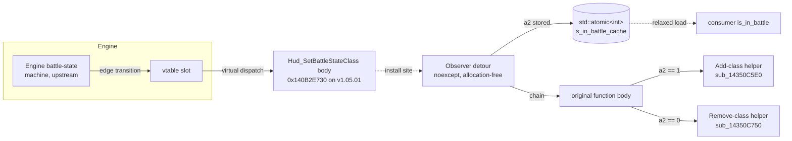
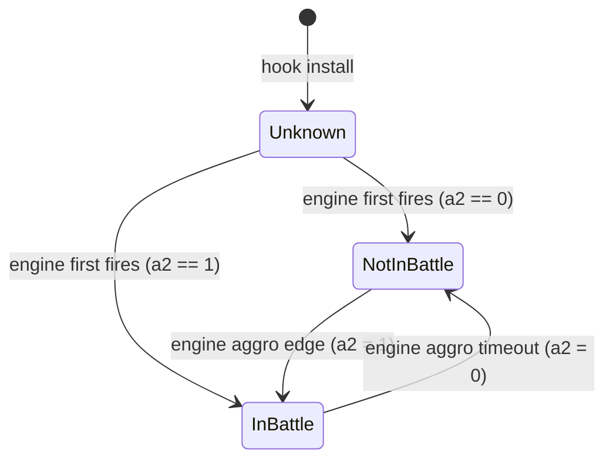

# Combat State Research

Self-contained reverse-engineering reference for the combat-state oracle in Crimson Desert. Covers what the oracle is, the byte-level evidence that backs it, the AOB signatures that locate it across builds, and the hook contract a consumer mod implements against it.

Verified against **Crimson Desert v1.05.01** (image base `0x140000000`, FileVersion `1.0.0.1070`). The function body shifted between v1.03.01 and v1.05.01; the wildcarded body-anchored pattern (Candidate B) carried through unchanged; the prologue pattern (Candidate A) needed a one-byte register-tail update.

Prerequisites for readers working with the AOB patterns in section 2: the DetourModKit AOB authoring rules at [docs/misc/aob-signatures.md in tkhquang/DetourModKit](https://github.com/tkhquang/DetourModKit/blob/main/docs/misc/aob-signatures.md). The two signatures below follow its wildcard, anchor-byte, and multi-candidate-fallback guidance.

---

## 1. The oracle: `Hud_SetBattleStateClass`

### 1.1 Semantic role

The engine flips a "battle" CSS class on every HUD child control whenever the player's combat-engagement state changes. The method that performs the add-or-remove is a virtual function on the HUD controller class. Its second argument (`a2`, received in `dl`) is the authoritative `inBattle` boolean. No other static instruction in the binary gates on the same bool with the same edge-triggered cadence.

```c
// prototype (IDA decompile verbatim, trimmed)
_BYTE *__fastcall Hud_SetBattleStateClass(__int64 hudCtrl, char inBattle);
```

Why this method and not the upstream battle-state machine: the upstream producer is buried behind aggro-tick state and animation-event routing, and is rewritten between major builds. The HUD CSS sink has held its byte-level shape across v1.03 -> v1.05 because the small_vector<int, 3> cap=3 sentinel pair is locked to the three-element CSS class list the HTML-style HUD renderer expects. The pattern at the body anchors to a renderer contract, not a game-design choice.

Data flow from the engine's battle-state machine through the hook to the HUD CSS fan-out, and the observer path the detour adds:



State machine the oracle models. The `Unknown` state exists only between hook install and the first invocation by the engine; in normal play it is exited within one frame of any HUD CSS rebuild:



### 1.2 Absolute address and RVA

```text
Hud_SetBattleStateClass
  v1.05.01 absolute : 0x140B2E730
  RVA               : 0x00B2E730   (= absolute - image_base 0x140000000)
  Add CSS helper    : sub_14350C5E0
  Remove CSS helper : sub_14350C750
  CSS class hashes  : MEMORY[0x145E1FC50], MEMORY[0x145E1FC54], MEMORY[0x145E1FC58]
```

The CSS class triple is consumed by the inline `small_vector<int, cap=3>` pair the function builds before fanning out across child controls. The three values are sequential indices (NOT FNV-style hashes) into the engine's IndexedStringA pool global at `0x145DDF5A0`; they identify the CSS class-name variants the HUD tracks for combat state. Their concrete numeric values are not load-bearing for the hook itself, but they are useful when reasoning about the state machine.

| Slot | Address | Index | String |
|------|---------|-------|--------|
| `MEMORY[0x145E1FC50]` | base | `0x648` | `cpp-battle-state` |
| `MEMORY[0x145E1FC54]` | none | `0x649` | `cpp-battle-state-none` |
| `MEMORY[0x145E1FC58]` | complete | `0x64A` | `cpp-battle-state-complete` |

Resolved via the IndexedStringA layout: `tableArray = *(holder + 0x58)` (holder = `0x145DDF5A0` per the MapLookup cascade), `entry = tableArray + index * 16`, `strPtr = *entry`. Stride is 16 bytes; the trailing 8 bytes hold (length, region/flags) packed.

### 1.3 Prototype and argument-flow evidence

```asm
; entry on v1.05.01 (IDA disassembly, raw on-disk bytes)
140b2e730  48 89 5C 24 08           mov   [rsp+0x08], rbx      ; save RBX to shadow space
140b2e735  48 89 74 24 10           mov   [rsp+0x10], rsi      ; save RSI to shadow space
140b2e73a  48 89 7C 24 18           mov   [rsp+0x18], rdi      ; save RDI to shadow space
140b2e73f  55                       push  rbp
140b2e740  48 8B EC                 mov   rbp, rsp
140b2e743  48 81 EC 80 00 00 00     sub   rsp, 0x80            ; 4-byte imm32, distinctive
140b2e74a  48 8B F9                 mov   rdi, rcx             ; preserve hudCtrl across calls
140b2e74d  48 8D 45 D0              lea   rax, [rbp-0x30]      ; stash addr of class-list buffer #2
140b2e751  48 89 45 C0              mov   [rbp-0x40], rax
140b2e755  33 C9                    xor   ecx, ecx             ; zero count field
140b2e757  89 4D C8                 mov   [rbp-0x38], ecx      ; count_2 = 0
140b2e75a  C7 45 CC 03 00 00 00     mov   dword [rbp-0x34], 3  ; cap_2 = 3   (first sentinel)
140b2e761  48 8D 45 F0              lea   rax, [rbp-0x10]
140b2e765  48 89 45 E0              mov   [rbp-0x20], rax
140b2e769  89 4D E8                 mov   [rbp-0x18], ecx      ; count_1 = 0
140b2e76c  C7 45 EC 03 00 00 00     mov   dword [rbp-0x14], 3  ; cap_1 = 3   (second sentinel)
140b2e773  84 D2                    test  dl, dl               ; test a2 (inBattle)
140b2e775  0F 84 ...                jz    <remove path>        ; false -> remove class path
                                                                ; fall through -> add class path
```

Two in-place-constructed `small_vector<int, cap=3>` objects receive three class-name hashes each, then fan out through the add-helper or remove-helper across the hudCtrl's child list.

Note the prologue change vs v1.03.01: the arg-0 preserve register is RDI (`48 8B F9`) on v1.05.01, was RSI (`48 8B F1`) on v1.03.01. The compiler-driven choice is a single byte flip in the ModRM. The wildcarded form `48 8B ??` (Candidate A below) tolerates both.

### 1.4 Semantic confirmation (live verification)

Dynamic verification installed a detour and logged every `a2` transition. Observed behaviour was edge-only, weapon-agnostic, and quiet during HUD-suppressed loading transitions, all consistent with engine-aggro semantics rather than weapon-stance semantics.

---

## 2. AOB signatures

Two candidates are shipped together. The first is tight and anchors on the function prologue. The second anchors on a distinctive inline sequence 42 bytes into the body and is used as a fallback when a future patch retunes the prologue (for example, drops the shadow-space saves or inlines the function). Both are authored under the rules in the [DetourModKit AOB guide](https://github.com/tkhquang/DetourModKit/blob/main/docs/misc/aob-signatures.md).

### 2.1 Candidate A: `HudSetBattleState_P1_FullPrologue`

```text
48 89 5C 24 ?? 48 89 74 24 ?? 48 89 7C 24 ?? 55 48 8B EC 48 81 EC ?? ?? ?? ?? 48 8B ??
```

| Field             | Value                                                            |
|-------------------|------------------------------------------------------------------|
| Length            | 29 bytes                                                         |
| Literal bytes     | 20                                                               |
| Wildcards         | 9 (4 disp8 stack offsets, 4 imm32 stack-alloc bytes, 1 ModRM byte) |
| Anchor landing    | Function entry (offset 0 inside match)                           |
| `offset_to_hook`  | `0`                                                              |

Anatomy, byte by byte:

```asm
48 89 5C 24 ??   mov [rsp+disp8], rbx   ; shadow-space save, wildcard disp8
48 89 74 24 ??   mov [rsp+disp8], rsi   ; shadow-space save, wildcard disp8
48 89 7C 24 ??   mov [rsp+disp8], rdi   ; shadow-space save, wildcard disp8
55               push rbp
48 8B EC         mov rbp, rsp           ; frame pointer
48 81 EC ?? ?? ?? ??  sub rsp, imm32    ; 4-byte imm (unusual; imm8 would be 48 83 EC)
                                        ; wildcard full imm because frame size may shift
48 8B ??         mov <preserve>, rcx    ; arg-0 stash; ModRM wildcard tolerates RSI / RDI / etc.
```

The 4-byte `sub rsp, imm32` (opcode `48 81 EC`) is the rarest literal byte in the pattern. Most functions that need under 128 bytes of frame use the 3-byte `48 83 EC imm8` form; this function needs `0x80`, which is right on the boundary where MSVC sometimes emits the long form. Combined with the three shadow-space stores immediately followed by a frame pointer setup, the prologue narrows to a small class of HUD controller methods. The terminal `48 8B ??` was tightened to `48 8B F1` on v1.03.01; widening it to a wildcard ModRM survived the v1.05.01 re-codegen at the cost of one ambiguity bit, still landing 1 hit on the module scan.

### 2.2 Candidate B: `HudSetBattleState_P2_InlineClassListPair`

```text
C7 45 ?? 03 00 00 00 48 8D 45 ?? 48 89 45 ?? 89 4D ?? C7 45 ?? 03 00 00 00 84 D2 0F 84
```

| Field             | Value                                                                 |
|-------------------|-----------------------------------------------------------------------|
| Length            | 28 bytes                                                              |
| Literal bytes     | 22                                                                    |
| Wildcards         | 6 (5 disp8 stack offsets, no imm32 / rel32 inside the body)           |
| Anchor landing    | Function body at offset `+0x2A` from function start                   |
| `offset_to_hook`  | `-0x2A` (apply this to the raw match to land on the prologue)         |

Anatomy:

```asm
C7 45 ?? 03 00 00 00   mov dword [rbp+disp8], 3    ; cap_2 = 3 (first small_vector sentinel)
48 8D 45 ??            lea rax, [rbp+disp8]        ; buffer address
48 89 45 ??            mov [rbp+disp8], rax        ; store buffer
89 4D ??               mov [rbp+disp8], ecx        ; count_1 = 0 (ecx is still zero from 33 C9)
C7 45 ?? 03 00 00 00   mov dword [rbp+disp8], 3    ; cap_1 = 3 (second sentinel)
84 D2                  test dl, dl                 ; branch on a2 (inBattle)
0F 84                  jz (rel32 opcode prefix)    ; near jz whose rel32 is the next 4 bytes
```

Two adjacent 7-byte `C7 45 ?? 03 00 00 00` instructions within a 22-byte span are already unusual; the third literal `84 D2 0F 84` that follows is the textbook "test a single boolean arg, branch via near-jz" idiom. The trailing `0F 84` near-jz opcode is what makes this candidate unique in the v1.05.01 module scan (the cap-3 sentinel pair on its own appears in a sibling function that does not follow it with `0F 84`).

The rel32 bytes of the `jz` are intentionally not part of the pattern. They change every build because the distance to the remove-path branch body depends on the size of the add-path body above it; leaving them off the pattern keeps it patch-robust without losing uniqueness.

### 2.3 Candidate registration shape

A consumer that uses DetourModKit's multi-candidate fallback pattern would register both signatures in a `{name, pattern, offset_to_hook}` array and resolve in order. Shown here in a generic shape; adapt to whatever candidate struct the consumer uses.

```cpp
struct AobCandidate {
    const char*    name;
    const char*    pattern;
    std::ptrdiff_t offset_to_hook;
};

inline constexpr AobCandidate k_hudSetBattleStateCandidates[] = {
    {
        "HudSetBattleState_P1_FullPrologue",
        "48 89 5C 24 ?? 48 89 74 24 ?? 48 89 7C 24 ?? 55 48 8B EC "
        "48 81 EC ?? ?? ?? ?? 48 8B ??",
        /*offset_to_hook=*/0,
    },
    {
        "HudSetBattleState_P2_InlineClassListPair",
        "C7 45 ?? 03 00 00 00 48 8D 45 ?? 48 89 45 ?? 89 4D ?? "
        "C7 45 ?? 03 00 00 00 84 D2 0F 84",
        /*offset_to_hook=*/-0x2A,
    },
};
```

When P1 stops matching on a future patch, P2 takes over because its anchor is in the function body, which cannot move without also retuning the inline `small_vector<int, 3>` construction idiom.

---

## 3. Hook contract

Generic, mod-agnostic reference for any consumer that wants to observe combat-state transitions. Consumers install an inline hook at the address resolved via the AOB pair in section 2.

### 3.1 Prototype to match

```cpp
using HudSetBattleStateFn =
    void (*)(std::uintptr_t hudCtrl, char inBattle);
```

Microsoft x64 calling convention: `hudCtrl` arrives in `rcx`, `inBattle` in `dl`. The return value is a pointer that the engine ignores at most call sites; a detour can return whatever the original returned.

### 3.2 Minimal observer detour

The detour below captures `inBattle` into an atomic and chains to the original. It is `noexcept` and allocation-free so it is safe to run on the HUD thread at any cadence.

```cpp
#include <atomic>
#include <cstdint>

namespace observer
{
    using HudSetBattleStateFn =
        void (*)(std::uintptr_t hudCtrl, char inBattle);

    inline HudSetBattleStateFn s_original = nullptr;

    // -1 = never observed; 0/1 = last observed inBattle bool.
    inline std::atomic<int> s_in_battle_cache{-1};

    inline void detour(std::uintptr_t hudCtrl, char inBattle) noexcept
    {
        s_in_battle_cache.store(inBattle ? 1 : 0, std::memory_order_relaxed);
        if (s_original)
            s_original(hudCtrl, inBattle);
    }

    inline bool is_in_battle() noexcept
    {
        return s_in_battle_cache.load(std::memory_order_relaxed) == 1;
    }
}
```

Consumers that want edge logging should compare the previous value with `exchange` and emit a line only on transition, to avoid log spam at HUD-cadence polling frequencies.

### 3.3 Install shape

Pseudocode for the install, hook-library-agnostic:

```text
addr = aob_resolve(k_hudSetBattleStateCandidates)
if addr != 0:
    original = install_inline_hook(addr, observer::detour)
    observer::s_original = original
else:
    log_warning("HudSetBattleState AOB scan failed; is_in_battle() will always return false")
```

The consumer is responsible for choosing a hooking library (SafetyHook, MinHook, Detours, etc.) and for running the AOB scan during a safe window (startup or a loading screen, not on the render thread).

### 3.4 Consumer contract

```cpp
// After install has run:
if (observer::is_in_battle())
{
    // consumer-specific logic
}
```

The accessor is lock-free and costs one relaxed atomic load. It returns `false` both when the engine has not yet fired the HUD sink since hook install (rare; the engine normally fires within one frame of any HUD CSS rebuild) and when the player is genuinely not in battle. If a consumer needs the three-state "unknown / not in battle / in battle" distinction, extend the accessor rather than reinterpreting the return value.

### 3.5 Compatibility with HUD-suppression tools

The detour fires on the engine's state-update path, not on the HUD render pass. Tools that suppress HUD rendering at the graphics-API layer (ReShade overlays, render hooks, in-game "Hide UI" toggles) change what is drawn, not what the state-update method is invoked with, and therefore do not affect this hook. Only a mod that actively destroys or unhooks the HUD controller instance would silence this oracle; such mods are rare and out of scope for a default build.

---

## 4. Why the HUD CSS sink and not the engine-side flag

A static byte at `0x145C1DC5C` on v1.03.01 looked like a sole-writer combat flag (cmp byte / mov byte 0 or 2 store pair, edge-guarded). Live hardware-write breakpoint testing on v1.03.01 captured 350 writes in 88 seconds, alternating 0 and 2 at ~4 hits per second regardless of combat state. The byte is an internal HUD-tick oscillator, not an oracle. Static "sole-writer + edge-guarded + constant domain" patterns are not sufficient to claim a flag; dynamic verification is mandatory.

The HUD CSS swap method passes the test the static byte fails: it fires exactly once per real engine transition, in either direction, and stays quiet during HUD-suppressed cutscenes. That edge-only cadence is what consumers want.

---

## 5. Known caveats

* The hook fires on HUD cadence, not engine cadence. The two are identical in normal play; they may drift by a frame during HUD-off loading transitions. If a future consumer needs tighter timing, hook the upstream producer instead: it is the caller of the HUD CSS-swap vtable slot, reachable from any instance of the containing HUD controller class.
* The method is virtual. Future patches could relocate the vtable slot even if the method body is stable, or vice versa. AOB scans bind to the body, not the slot, so slot motion is invisible to the consumer; body motion is handled by the two-candidate fallback.
* `imm32` stack-alloc size `0x80` is right on the boundary where MSVC may switch to `imm8` on a recompile. If that happens, P1 loses the `48 81 EC` literal and will stop matching; P2 (which anchors in the body) continues to work. This was anticipated when picking the two candidates.
* A future game patch may change the CSS class name list to a variant that uses two or four entries instead of three. The two `C7 45 ?? 03 00 00 00` literals in P2 would then become `C7 45 ?? 02 00 00 00` or `C7 45 ?? 04 00 00 00`, breaking that candidate. P1 still matches because the prologue does not encode the list length. Re-derive P2 if this happens.
* The detour must be `noexcept`: the game engine does not expect C++ exceptions to cross this boundary. Keep the atomic write the only work in the detour body; move any expensive consumer-side logic behind the accessor.

---

## 6. Cross-build deltas

| What                                                | v1.03.01      | v1.05.01      |
|-----------------------------------------------------|---------------|---------------|
| Function entry                                      | `0x140B17870` | `0x140B2E730` |
| Add-class helper                                    | `sub_1433EBD10` | `sub_14350C5E0` |
| Remove-class helper                                 | `sub_1433EBE70` | `sub_14350C750` |
| CSS hash triple base                                | `0x145C5D0D0` | `0x145E1FC50` |
| Arg-0 preserve register (last byte of P1 pattern)   | `48 8B F1` (rsi) | `48 8B F9` (rdi) |
| P1 ModRM byte                                       | literal       | wildcard `??` (tolerates the register repurpose) |
| P2 anchor body shape                                | identical     | identical (no change) |

The body-anchored P2 pattern is the reason the cascade survived the v1.05 patch with one trivial header tweak: anchoring on the renderer-side small_vector contract (cap=3 sentinels paired with `test dl; jz`) is more durable than anchoring on the prologue, because the contract is forced by the surrounding renderer plumbing.
