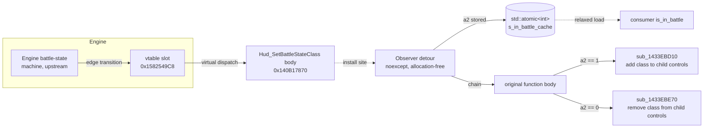
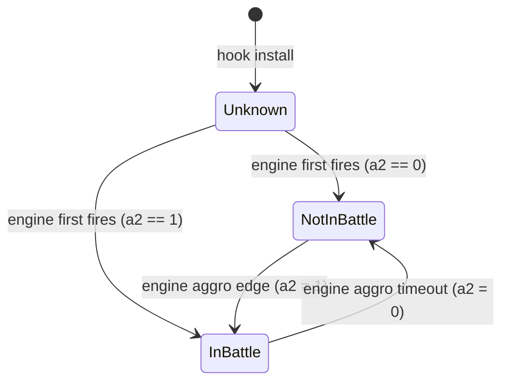
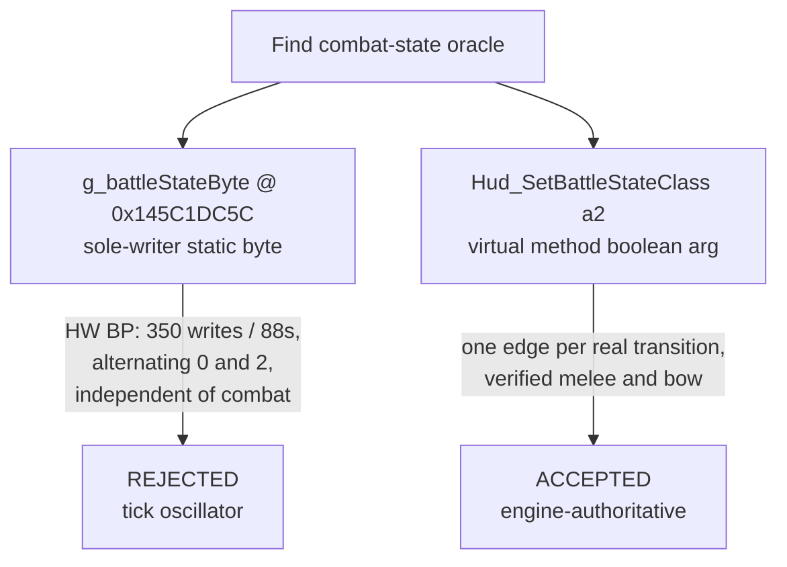

# Combat State Research

Self-contained reverse-engineering reference for the combat-state oracle in Crimson Desert. Covers how the oracle was found, the byte-level evidence that backs it, the AOB signatures that locate it across builds, and the hook contract a consumer mod would implement against it. No dependency on other research files; rejected hypotheses are falsified inline.

Verified against **Crimson Desert v1.03.01** (image base `0x140000000`). IDA anchors spot-checked 2026-04-22 (see section 7).

Prerequisites for readers working with the AOB patterns in section 2: the DetourModKit AOB authoring rules at [docs/misc/aob-signatures.md in tkhquang/DetourModKit](https://github.com/tkhquang/DetourModKit/blob/main/docs/misc/aob-signatures.md). The two signatures below follow its wildcard, anchor-byte, and multi-candidate-fallback guidance.

---

## 1. The oracle: `Hud_SetBattleStateClass`

### 1.1 Semantic role

The engine flips a "battle" CSS class on every HUD child control whenever the player's combat-engagement state changes. The method that performs the add-or-remove is a virtual function on the HUD controller class. Its second argument (`a2`, received in `dl`) is the authoritative `inBattle` boolean. No other static instruction in the binary gates on the same bool with the same edge-triggered cadence.

```c
// prototype (IDA decompile verbatim, trimmed)
_BYTE *__fastcall Hud_SetBattleStateClass(__int64 hudCtrl, char inBattle);
```

Call sites reach this function through a vtable slot rather than a direct `call`; the only data xref in `.rdata` is the slot itself. A thunk `j_Hud_SetBattleStateClass` at `0x140B25060` wraps the function for a single non-vtable caller. Neither matters for the hook: consumers install at the method body's first byte.

Data flow from the engine's battle-state machine through the hook to the HUD CSS fan-out, and the observer path the detour adds:



State machine the oracle models. The `Unknown` state exists only between hook install and the first invocation by the engine; in normal play it is exited within one frame of any HUD CSS rebuild:



### 1.2 Absolute address and RVA

```text
Hud_SetBattleStateClass
  v1.03.01 absolute : 0x140B17870
  RVA               : 0x00B17870   (= absolute - image_base 0x140000000)
  vtable slot       : 0x1582549C8  (sole .rdata xref; confirms virtual dispatch)
  thunk wrapper     : 0x140B25060  (j_Hud_SetBattleStateClass, 5 bytes, jmp rel32)
```

The vtable slot address stays useful even when the method body moves: the slot is in `.rdata`, its layout is stable across patches unless the class's vtable layout itself changes. Dereferencing `*(void**)0x1582549C8` after AOB-resolving the slot gives the current method address.

### 1.3 Prototype and argument-flow evidence

```asm
; entry (v1.03.01, raw on-disk bytes)
140b17870  48 89 5C 24 08           mov   [rsp+0x08], rbx      ; save RBX to shadow space
140b17875  48 89 74 24 10           mov   [rsp+0x10], rsi      ; save RSI to shadow space
140b1787a  48 89 7C 24 18           mov   [rsp+0x18], rdi      ; save RDI to shadow space
140b1787f  55                       push  rbp
140b17880  48 8B EC                 mov   rbp, rsp
140b17883  48 81 EC 80 00 00 00     sub   rsp, 0x80            ; 4-byte imm32 (not imm8), distinctive
140b1788a  48 8B F1                 mov   rsi, rcx             ; preserve hudCtrl across calls
140b1788d  48 8D 45 D0              lea   rax, [rbp-0x30]      ; stash addr of class-list buffer #2
140b17891  48 89 45 C0              mov   [rbp-0x40], rax
140b17895  33 C9                    xor   ecx, ecx             ; zero count field
140b17897  89 4D C8                 mov   [rbp-0x38], ecx      ; count_2 = 0
140b1789a  C7 45 CC 03 00 00 00     mov   dword [rbp-0x34], 3  ; cap_2 = 3   <- first sentinel
140b178a1  48 8D 45 F0              lea   rax, [rbp-0x10]
140b178a5  48 89 45 E0              mov   [rbp-0x20], rax
140b178a9  89 4D E8                 mov   [rbp-0x18], ecx      ; count_1 = 0
140b178ac  C7 45 EC 03 00 00 00     mov   dword [rbp-0x14], 3  ; cap_1 = 3   <- second sentinel
140b178b3  84 D2                    test  dl, dl               ; test a2 (inBattle)
140b178b5  0F 84 D9 00 00 00        jz    loc_140B17994        ; false -> remove class path
                                                                ; fall through -> add class path
```

Two in-place-constructed `small_vector<int, cap=3>` objects receive three class-name hashes each, then fan out through `sub_1433EBD10` (add) or `sub_1433EBE70` (remove) across the hudCtrl's child list. The three hashes (`dword_145C5D0D0`, `dword_145C5D0D4`, `dword_145C5D0D8`) are the interned names of the three class-suffix variants that the HUD CSS tracks; their concrete values are not needed for the hook.

### 1.4 Semantic confirmation (live verification)

Dynamic verification was performed on 2026-04-22 by installing a detour on the method via direct-RVA and logging every `a2` transition. Observed behaviour:

* Engaging a mob in melee produced exactly one `0 -> 1` log line, no repeats during the fight.
* Disengaging produced exactly one `1 -> 0` log line after the aggro timeout.
* Bow combat fired the same pair of transitions (confirming the method is melee-agnostic and keyed on engine-level aggro, not weapon-stance).
* HUD-suppressed modes (menus, deep cutscenes) are silent; the flag holds its last value across them, which matches the game's own "Show on battle" headgear setting.

---

## 2. AOB signatures

Two candidates are shipped together. The first is tight and anchors on the function prologue. The second anchors on a distinctive inline sequence 42 bytes into the body and is used as a fallback when a future patch retunes the prologue (for example, drops the shadow-space saves or inlines the function). Both are authored under the rules in the [DetourModKit AOB guide](https://github.com/tkhquang/DetourModKit/blob/main/docs/misc/aob-signatures.md).

### 2.1 Candidate A: `HudSetBattleState_P1_FullPrologue`

```text
48 89 5C 24 ?? 48 89 74 24 ?? 48 89 7C 24 ?? 55 48 8B EC 48 81 EC ?? ?? ?? ?? 48 8B F1
```

| Field             | Value                                                            |
|-------------------|------------------------------------------------------------------|
| Length            | 29 bytes                                                         |
| Literal bytes     | 21                                                               |
| Wildcards         | 8 (four `disp8` stack offsets, four `imm32` stack-alloc bytes)   |
| Anchor landing    | Function entry (offset 0 inside match)                           |
| `offset_to_hook`  | `0`                                                              |
| Verified hit count (v1.03.01, module scan) | 1                                    |

Anatomy, byte by byte:

```asm
48 89 5C 24 ??   mov [rsp+disp8], rbx   ; shadow-space save, wildcard disp8
48 89 74 24 ??   mov [rsp+disp8], rsi   ; shadow-space save, wildcard disp8
48 89 7C 24 ??   mov [rsp+disp8], rdi   ; shadow-space save, wildcard disp8
55               push rbp
48 8B EC         mov rbp, rsp           ; frame pointer
48 81 EC ?? ?? ?? ??  sub rsp, imm32    ; 4-byte imm (unusual; imm8 would be 48 83 EC)
                                        ; wildcard full imm because frame size may shift
48 8B F1         mov rsi, rcx           ; hudCtrl preserved across calls
```

The 4-byte `sub rsp, imm32` (opcode `48 81 EC`) is the rarest literal byte in the pattern. Most functions that need under 128 bytes of frame use the 3-byte `48 83 EC imm8` form; this function needs `0x80`, which is right on the boundary where MSVC sometimes emits the long form. Combined with the three shadow-space stores immediately followed by a frame pointer setup and an arg-preserve into `rsi`, the prologue narrows to a small class of HUD controller methods, and the explicit `48 8B F1` (not e.g. `48 8B F2`) narrows the arg-0 register to RCX, which is the Microsoft x64 convention for the first integer arg.

### 2.2 Candidate B: `HudSetBattleState_P2_InlineClassListPair`

```text
C7 45 ?? 03 00 00 00 48 8D 45 ?? 48 89 45 ?? 89 4D ?? C7 45 ?? 03 00 00 00 84 D2 0F 84
```

| Field             | Value                                                                 |
|-------------------|-----------------------------------------------------------------------|
| Length            | 28 bytes                                                              |
| Literal bytes     | 22                                                                    |
| Wildcards         | 6 (five `disp8` stack offsets, no `imm32` or `rel32` inside the body) |
| Anchor landing    | Function body at offset `+0x2A` from function start                   |
| `offset_to_hook`  | `-0x2A` (apply this to the raw match to land on the prologue)         |
| Verified hit count (v1.03.01, module scan) | 1                                         |

Anatomy:

```asm
C7 45 ?? 03 00 00 00   mov dword [rbp+disp8], 3    ; cap_2 = 3 (first small_vector sentinel)
48 8D 45 ??            lea rax, [rbp+disp8]        ; buffer address
48 89 45 ??            mov [rbp+disp8], rax        ; store buffer
89 4D ??               mov [rbp+disp8], ecx        ; count_1 = 0 (ecx is still zero from 33 C9)
C7 45 ?? 03 00 00 00   mov dword [rbp+disp8], 3    ; cap_1 = 3 (second sentinel)
84 D2                  test dl, dl                 ; branch on a2 (inBattle)
0F 84                  jz (rel32 opcode prefix)    ; near jz whose rel32 is the next 4 bytes
```

Two adjacent 7-byte `C7 45 ?? 03 00 00 00` instructions within a 22-byte span are already unusual; the third literal `84 D2 0F 84` that follows is the textbook "test a single boolean arg, branch via near-jz" idiom. A sibling function at `0x140CE9550` uses the same two-sentinel layout but does not follow it with `0F 84`, so the trailing opcode prefix is what makes this candidate unique in the v1.03.01 module.

Important: the rel32 bytes of the `jz` are intentionally not part of the pattern. They change every build because the distance to the remove-path branch body depends on the size of the add-path body above it; leaving them off the pattern keeps it patch-robust without losing uniqueness.

### 2.3 Candidate registration shape

A consumer that uses DetourModKit's multi-candidate fallback pattern would register both signatures in a `{name, pattern, offset_to_hook}` array and resolve in order. Shown here in a generic shape; adapt to whatever candidate struct the consumer uses.

```cpp
struct AobCandidate {
    const char*    name;
    const char*    pattern;
    std::ptrdiff_t offset_to_hook;
};

inline constexpr AobCandidate k_hudSetBattleStateCandidates[] = {
    {
        "HudSetBattleState_P1_FullPrologue",
        "48 89 5C 24 ?? 48 89 74 24 ?? 48 89 7C 24 ?? 55 48 8B EC "
        "48 81 EC ?? ?? ?? ?? 48 8B F1",
        /*offset_to_hook=*/0,
    },
    {
        "HudSetBattleState_P2_InlineClassListPair",
        "C7 45 ?? 03 00 00 00 48 8D 45 ?? 48 89 45 ?? 89 4D ?? "
        "C7 45 ?? 03 00 00 00 84 D2 0F 84",
        /*offset_to_hook=*/-0x2A,
    },
};
```

When P1 stops matching on a future patch, P2 takes over because its anchor is in the function body, which cannot move without also retuning the inline `small_vector<int, 3>` construction idiom.

---

## 3. Hook contract

Generic, mod-agnostic reference for any consumer that wants to observe combat-state transitions. Consumers install an inline hook at the address resolved via the AOB pair in section 2.

### 3.1 Prototype to match

```cpp
using HudSetBattleStateFn =
    void (*)(std::uintptr_t hudCtrl, char inBattle);
```

Microsoft x64 calling convention: `hudCtrl` arrives in `rcx`, `inBattle` in `dl`. The return value is a pointer that the engine ignores at most call sites; a detour can return whatever the original returned.

### 3.2 Minimal observer detour

The detour below captures `inBattle` into an atomic and chains to the original. It is `noexcept` and allocation-free so it is safe to run on the HUD thread at any cadence.

```cpp
#include <atomic>
#include <cstdint>

namespace observer
{
    using HudSetBattleStateFn =
        void (*)(std::uintptr_t hudCtrl, char inBattle);

    inline HudSetBattleStateFn s_original = nullptr;

    // -1 = never observed; 0/1 = last observed inBattle bool.
    inline std::atomic<int> s_in_battle_cache{-1};

    inline void detour(std::uintptr_t hudCtrl, char inBattle) noexcept
    {
        s_in_battle_cache.store(inBattle ? 1 : 0, std::memory_order_relaxed);
        if (s_original)
            s_original(hudCtrl, inBattle);
    }

    inline bool is_in_battle() noexcept
    {
        return s_in_battle_cache.load(std::memory_order_relaxed) == 1;
    }
}
```

Consumers that want edge logging should compare the previous value with `exchange` and emit a line only on transition, to avoid log spam at HUD-cadence polling frequencies.

### 3.3 Install shape

Pseudocode for the install, hook-library-agnostic:

```
addr = aob_resolve(k_hudSetBattleStateCandidates)
if addr != 0:
    original = install_inline_hook(addr, observer::detour)
    observer::s_original = original
else:
    log_warning("HudSetBattleState AOB scan failed; is_in_battle() will always return false")
```

The consumer is responsible for choosing a hooking library (SafetyHook, MinHook, Detours, etc.) and for running the AOB scan during a safe window (startup or a loading screen, not on the render thread).

### 3.4 Consumer contract

```cpp
// After install has run:
if (observer::is_in_battle())
{
    // consumer-specific logic
}
```

The accessor is lock-free and costs one relaxed atomic load. It returns `false` both when the engine has not yet fired the HUD sink since hook install (rare; the engine normally fires within one frame of any HUD CSS rebuild) and when the player is genuinely not in battle. If a consumer needs the three-state "unknown / not in battle / in battle" distinction, extend the accessor rather than reinterpreting the return value.

### 3.5 Compatibility with HUD-suppression tools

The detour fires on the engine's state-update path, not on the HUD render pass. Tools that suppress HUD rendering at the graphics-API layer (ReShade overlays, render hooks, in-game "Hide UI" toggles) change what is drawn, not what the state-update method is invoked with, and therefore do not affect this hook. Only a mod that actively destroys or unhooks the HUD controller instance would silence this oracle; such mods are rare and out of scope for a default build.

---

## 4. Alternative signals considered and rejected

This section captures the dead ends so that a future investigator does not re-run any of these probes. Each rejection is backed inline with the concrete CE and IDA evidence that falsified it.

Decision summary at a glance:



### 4.1 `g_battleStateByte @ 0x145C1DC5C`

Static analysis on 2026-04-22 identified a dispatcher at `0x1407BE110` that writes byte `0` or `2` to the global at `0x145C1DC5C`. Two RIP-relative stores were confirmed in the live binary:

```asm
1407BE271  80 3D E4 F9 45 05 02     cmp byte [rip+0x545F9E4], 2   ; edge-guard read
1407BE2BE  C6 05 97 F9 45 05 02     mov byte [rip+0x545F997], 2   ; Battle_On store
1407BE293  C6 05 ?? ?? ?? ?? 00     mov byte [rip+...........], 0 ; Battle_Off store
```

All three RIP-relative targets resolve to `0x145C1DC5C`. Initially this looked like a sole-writer, edge-guarded state flag. Dynamic CE verification overturned the claim:

* **Snapshot reads always returned `0`** regardless of combat state. A baseline read while engaging a mob returned `0x00`, contradicting the `= 2` semantic.
* **Hardware data-write breakpoint** on the byte captured 350 writes in 88 seconds, near-symmetric between the two store sites: 176 hits at the `byte = 2` store, 174 at the `byte = 0` store. Writes alternated rapidly at roughly 4 hits per second regardless of whether the player was idle, weapon-drawn, fighting, or chasing.

The byte is not a combat flag. It is an internal oscillator in the HUD's tick dispatcher, flipping on every frame pair the dispatcher runs. The static `sole-writer plus edge-guarded plus constant domain` fingerprint was misleading; dynamic verification is mandatory for any flag claim based purely on static pattern-matching.

---

## 5. Known caveats

* The hook fires on HUD cadence, not engine cadence. The two are identical in normal play; they may drift by a frame during HUD-off loading transitions. If a future consumer needs tighter timing, hook the upstream producer instead: it is the caller of the vtable slot at `0x1582549C8`, reachable from any instance of the containing HUD controller class.
* The method is virtual. Future patches could relocate the vtable slot even if the method body is stable, or vice versa. AOB scans bind to the body, not the slot, so slot motion is invisible to the consumer; body motion is handled by the two-candidate fallback.
* `imm32` stack-alloc size `0x80` is right on the boundary where MSVC may switch to `imm8` on a recompile. If that happens, P1 loses the `48 81 EC` literal and will stop matching; P2 (which anchors in the body) continues to work. This was anticipated when picking the two candidates.
* A future game patch may change the CSS class name to a variant that uses two or four entries instead of three. The two `C7 45 ?? 03 00 00 00` literals in P2 would then become `C7 45 ?? 02 00 00 00` or `C7 45 ?? 04 00 00 00`, breaking that candidate. P1 still matches because the prologue does not encode the list length. Re-derive P2 if this happens.
* The detour must be `noexcept`: the game engine does not expect C++ exceptions to cross this boundary. Keep the atomic write the only work in the detour body; move any expensive consumer-side logic behind the accessor.

---

## 6. IDA verification status (2026-04-22)

Spot-checked against the v1.03.01 IDB:

| Anchor                                                                   | Status    |
|--------------------------------------------------------------------------|-----------|
| `Hud_SetBattleStateClass @ 0x140B17870`                                  | VERIFIED  |
| Thunk `j_Hud_SetBattleStateClass @ 0x140B25060` (5-byte `E9 rel32`)      | VERIFIED  |
| Vtable slot `.rdata @ 0x1582549C8` (sole data xref)                      | VERIFIED  |
| AOB P1 (`48 89 5C 24 ?? ... 48 8B F1`, 29 bytes)                         | 1 MATCH   |
| AOB P2 (`C7 45 ?? 03 00 00 00 ... 84 D2 0F 84`, 28 bytes)                | 1 MATCH   |
| Sibling pattern at `0x140CE9550` (ruled out by `0F 84` tail)             | VERIFIED  |
| `sub_1433EBD10` (add CSS class helper)                                   | VERIFIED  |
| `sub_1433EBE70` (remove CSS class helper)                                | VERIFIED  |
| CSS-class interned hashes at `dword_145C5D0D0` / `+4` / `+8`             | VERIFIED  |
| `g_battleStateByte @ 0x145C1DC5C` (section 4.1; oscillator, not oracle)  | VERIFIED  |

Deferred verification (recommend a pass if any of these are edited):

* The inline `small_vector<int, 3>` struct layout. Assumed at bytes-from-rbp `{-0x40 buffer*, -0x38 count, -0x34 cap}` and mirror `{-0x20 buffer*, -0x18 count, -0x14 cap}`. Values are not needed for the hook but matter if a consumer wants to read the pending class-name vector.
* The vtable layout of the HUD controller class. Not needed unless a consumer wants to intercept via vtable hook rather than inline hook.

---

Maintained alongside the source binary it describes; bump the "Verified game version" line at the top whenever an address or AOB is re-probed against a new patch.
