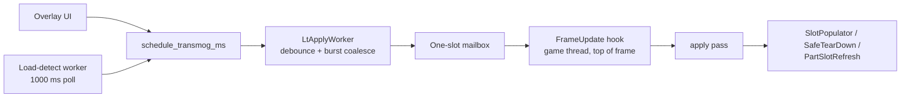
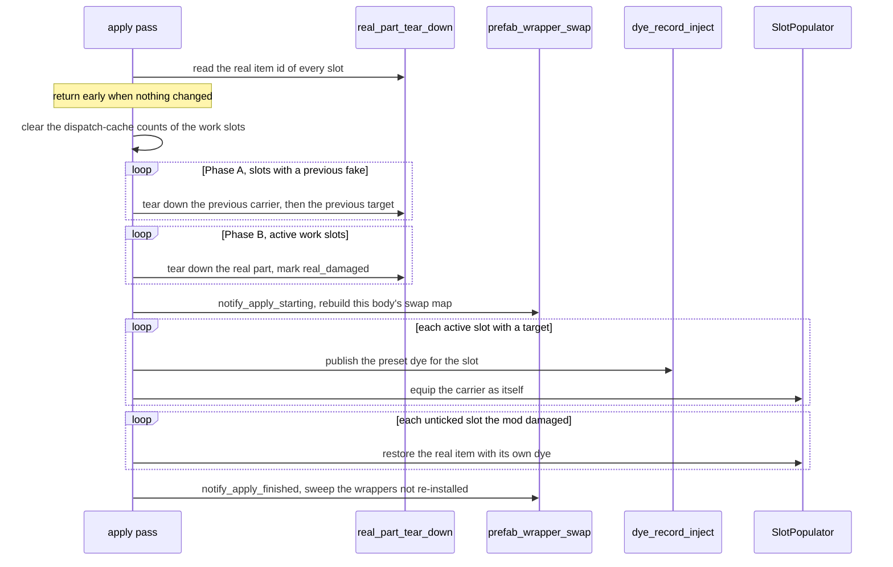

# Live Transmog - Runtime Architecture

Reference for the Live Transmog runtime pipeline. This document states the mechanism only. Memory geometry lives in [live-transmog-source-of-truth.md](live-transmog-source-of-truth.md). The mesh-substitution layer has its own entry in [live-transmog-prefab-wrapper-swap.md](live-transmog-prefab-wrapper-swap.md).

Verified against **Crimson Desert 2.03.00** (image base `0x140000000`, FileVersion `1.0.0.2944`).

---

## 1. Core mechanism

The engine owns the rule that decides which mesh each equip slot draws. The mod does not rewrite that rule. It performs two steps per dressed slot:

1. It equips a **carrier** item that the wearer body can legitimately wear, through the engine's own `SlotPopulator`.
2. It rewrites the mesh the engine builds for that slot, inside the build itself.

The carrier is a real item and the mod equips it as itself. No descriptor is falsified and no equip gate is defeated. The authoritative equip table stays untouched, so the save file records the real gear and the mod state dies with the process.

Two seams perform the rewrite. `PartDescriptorBuild` receives the slot tag, so an override there is keyed by **socket** and catches any item the engine builds. `StructCopy` sits deeper and knows no slot, so a substitution there is keyed by the **source prefab name hash**, which is what a carrier supplies. Section 5 states the division.

### Why the engine drives the apply

The engine re-derives its part list from the authoritative table on most state transitions: zone load, save load, body swap, glide exit and dismount. A direct mutation of that list is wiped on every transition. A carrier equip through `SlotPopulator` makes the engine treat the substituted mesh as the item it decided to equip. Cleanup is then correct on every path the engine already supports.

---

## 2. Terminology

| Term | Plain English | Technical meaning |
|------|---------------|-------------------|
| **Real item** | What the inventory screen shows for the character. | Entry in the authoritative equip table. Written to the save file. |
| **Target** | The look the player picked. | `slot_mappings()[i].target_item_id` in mod memory. Never persisted to the save file. |
| **Carrier** | A plain item the mod equips to create a part record. | One cell of `CARRIERS` in `carrier_defaults.hpp`, keyed by character and slot. |
| **Authoritative table** | The equipment record the server syncs. | Container off the equip-slot component. See the source-of-truth entry, section 2.1. |
| **Dispatch cache** | Per-slot queue the engine replays on a visual change. | Triple on the equip-slot component. Append-only count. |
| **Prefab wrapper** | The engine's handle for one named mesh asset. | Record whose `+0x0C` field holds the prefab name hash. |
| **Tear-down** | Detach a part from the live scene graph. | `SafeTearDown`, called directly. |
| **`a1`** | The body the mod dresses. | `pa::ClientEquipSlotActorComponent`. |
| **Apply pass** | One full dress of every slot. | `apply_all_transmog()` in `transmog_apply.cpp`. |

---

## 3. Trigger and execution model

The mod installs no equip-event hook. Neither `BatchEquip` nor `VisualEquipChange` is hooked, because both report an equip that already happened, which makes the real mesh visible until the mod reacts. The socket override replaces that role: it corrects the slot while the engine builds it.

Three producers request an apply:

- The overlay, for a preset click, a picker change, a hotkey or a clear.
- The load-detect worker, for a world load, a save load, a body swap, a companion spawn, or a released real item.
- The mod's own single-slot paths, for an instant-apply pick.

```mermaid
flowchart LR
    UI[Overlay UI] --> SCH[schedule_transmog_ms]
    LD[Load-detect worker<br/>1000 ms poll] --> SCH
    SCH --> W[LtApplyWorker<br/>debounce + burst coalesce]
    W --> MB[One-slot mailbox]
    MB --> FU[FrameUpdate hook<br/>game thread, top of frame]
    FU --> AP[apply pass]
    AP --> ENG[SlotPopulator / SafeTearDown /<br/>PartSlotRefresh]
```

A request bumps a deadline and wakes the worker. The worker waits out the debounce, so a burst of preset clicks builds only the preset the player lands on. The worker then posts the apply body into a one-slot mailbox and blocks.

**Every engine-mutating call runs on the game thread.** The mailbox drains at the entry of the per-frame update step, before that frame's scene-graph work. The engine walks its appearance-claim vectors without locks, on the main thread only. A tear-down issued from another thread erases an owner slot that a main-thread walk is about to dereference, which faults. The frame hook removes that whole class of race.

Two failure modes are explicit. The mailbox reports unavailable when the `FrameUpdate` anchor misses, and when the mid hook fails to install. The worker then runs the apply on its own thread. If no frame claims the job within the timeout, the worker withdraws it and re-arms.

---

## 4. One apply pass

`apply_all_transmog()` walks a local copy of the slot mappings. Disabled slots are masked out. A slot with no work is skipped without an engine call.

```mermaid
sequenceDiagram
    participant A as apply pass
    participant T as real_part_tear_down
    participant P as prefab_wrapper_swap
    participant D as dye_record_inject
    participant E as SlotPopulator
    A->>T: read the real item id of every slot
    Note over A: return early when nothing changed
    A->>A: clear the dispatch-cache counts of the work slots
    loop Phase A, slots with a previous fake
        A->>T: tear down the previous carrier, then the previous target
    end
    loop Phase B, active work slots
        A->>T: tear down the real part, mark real_damaged
    end
    A->>P: notify_apply_starting, rebuild this body's swap map
    loop each active slot with a target
        A->>D: publish the preset dye for the slot
        A->>E: equip the carrier as itself
    end
    loop each unticked slot the mod damaged
        A->>E: restore the real item with its own dye
    end
    A->>P: notify_apply_finished, sweep the wrappers not re-installed
```

**Phase A** removes the previous look. It tears down the previous carrier and the previous target by item id, so a preset switch leaves nothing of the outgoing preset attached.

**Phase B** removes the real part. It walks the authoritative table for the slot tag, converts the item word into the engine's descriptor hash, and calls `SafeTearDown`. The walk reads. It never writes an entry.

Tear-down is rationed on purpose. It runs for a slot that ends empty and for a slot that gains its first fake. On an armor or accessory slot a target-to-target change is left to the post-apply sweep, which detaches the wrappers the new apply did not re-install. A weapon-family slot always tears down, because its mount holds one record per part name.

**The equip** is one `SlotPopulator` call per slot, inside a structured-exception frame. A paired slot needs more than the item. Both halves of a pair report one item type, so the engine's own derivation always resolves to the first half. For those slots the call names the destination tag outright. Ring1, Ring2, Earring1, Earring2 and OffHand all need that. The component's candidate-exclusion list is the fallback. When the named tag owns no live part record, the call drops the name and excludes the first half instead. Only Ring2, Earring2 and OffHand name a first half to exclude.

**The restore** re-equips the real item through the same call when the player unticks a slot the mod had damaged.

**The suppression mask** is set after the loop. It carries one bit per slot whose target differs from the real item. Only the five armor slots own a `CD_*` part name, so a bit for any other slot resolves to no hash and suppresses nothing. See section 5.

---

## 5. Mesh substitution seams

Five hooks carry the substitution. Each one has a single job.

| Hook | Keyed by | Job |
|------|----------|-----|
| `PartDescriptorBuild` | Socket, from the slot-tag argument | Rewrite the mesh wrapper of every descriptor the build appended, and point the record's dye vector at the preset's records for the duration of the build. |
| `StructCopy` | Source prefab name hash | Rewrite the wrapper of a staging descriptor as the engine copies it. |
| `PartListMerge` | Assembly node | Publish which protagonist the nested copies belong to, so the substitution picks that body's bucket. |
| `NaturalPipeline` | Source prefab name hash | Rewrite the unlink list, so the engine's content-keyed search finds what the mod installed. |
| `UnlinkByWrapper` | Wrapper | Observe a claim removal. The sweep also calls it directly to erase a stale claim. |

The socket override is what removes the flash. The engine builds the target mesh in the first place, so no real mesh is ever drawn and none must come off afterwards. The override fires for every reason the engine has to build a part. That set includes an item-to-item replace, which no equip event reports.

`PartAddShow` is a separate hook, outside the substitution set. Some transitions bypass the visibility decision and show a part directly. The detour returns zero for any part hash in the published suppression mask. When EquipHide is loaded in the same process, the mod does not install this hook and yields the shared prologue to EquipHide.

---

## 6. Memory write surface

| Target | Size | When | Reason | Restore |
|--------|------|------|--------|---------|
| Dispatch-cache entry counts | 4 bytes per entry | Each apply and each clear | Silence a queued blob whose slot holds nothing | Natural overwrite by the next `SlotPopulator` call |
| Candidate-exclusion list and count | 12 bytes | Around one paired-slot equip | Hide the first half of a pair for one resolution | Restored in the same function, on the fault path too |
| Prefab wrapper field of a descriptor | 8 bytes per descriptor | Inside a part build or a record copy | Install the target mesh | The record is rebuilt by the engine or detached by the sweep |
| Unlink-list entries | 8 bytes per entry | Around one `NaturalPipeline` call | Let the engine's unlink find the installed wrapper | Originals restored after the trampoline |
| Part-record dye vector pointer | 8 bytes | Around one part build | Give the build the preset's dye records | Pointer and count restored after the trampoline |
| Dye record in the copier's destination vector | 13 bytes of a 16-byte record | Inside one `DyeCopier` call | Give the slot the preset's color | The engine refills the vector on the next part build |
| Prefab metadata part name | 4 bytes per prefab | Around a weapon apply | Make the target declare the part the draw and stow mover looks for | Journalled, then put back by the sweep and at shutdown |
| Claim-vector entry and count | 12 bytes per moved entry, 4 for the count | Inside the post-apply sweep | Close the null-owner hole the synthesized detach leaves | Permanent. The engine's own erase does the same |
| Prefab wrapper refcount | 4 bytes per target | Around one substitution | Balance the engine's later release of that wrapper | Released on detach for a swap install |

No write reaches the authoritative equip table, its entries or any save-backed state. The mod patches no instruction bytes. Every hook is a managed inline or mid hook. The hook stack restores them newest first at unload. A hook that cannot prove a restore pins its own backend, so no stale trampoline stays live.

---

## 7. State transitions

| Event | What the mod observes | Response |
|-------|----------------------|----------|
| World load or save load | The controlled body pointer changes. | Wipe the per-character ledger, drop the buffered picks, re-apply from the preset. |
| Body swap | The load-detect poll reports a different controlled character. | Switch the preset list, rebuild the mappings, schedule an apply. A settle window absorbs the rotation the engine performs during world wiring. |
| Equip change by the player | Nothing. The mod holds no equip hook. | The socket override corrects the slot as the engine builds it. |
| Companion spawn or respawn | The world generation counter bumps, or a new body appears. | Schedule an apply against that body. |
| Mod unload | Shutdown runs one clear pass through the ordinary apply path. | Visuals retract through the same code the player's Clear uses. |

The load-detect worker polls once per second and stores the resolved component. Before it schedules an apply, it runs a readiness probe. The engine parks the equip-slot component on a placeholder during a world load, and an engine call against that placeholder faults. The probe checks the container chain and the sub-handler pointer `SafeTearDown` dereferences.

---

## 8. Guards

`in_transmog` marks that the mod, and not the player, drives the current engine call. The socket override and the prefab-swap hooks read it. It covers `SlotPopulator` and `PartSlotRefresh` only.

`in_engine_tear_down` is a thread-local latch raised around the mod's own tear-down call. The natural-pipeline hook must substitute nothing while the mod is disabled, because the engine's own unequip then reaches a target that is not attached. The mod's own tear-down is the exception, because there the target is what hangs on the body.

Every guard is paired with a restore on both the normal and the structured-exception path. A fault during an apply cannot leave a hook gagged.

---

## 9. Patch migration

Almost every engine address resolves at startup through the anchor registry in `aob_resolver.hpp`. The item-name table is the exception, because it walks the `SubTranslator` prologue to reach `IndexedStringLookup` and the iteminfo holder. The registry resolves the whole table in one parallel pass and validates each result. It corroborates three hooked functions against their class vtable slot, and `FrameUpdate` against a string-literal witness. A miss degrades one feature and is logged. It never becomes a hook on an unrelated address.

On patch day, work in this order:

1. Read the startup anchor summary. It names every anchor that failed.
2. Re-author the failed ladder against the live image. Sign code, not data.
3. Re-derive each runtime data offset from its own live instruction. Section 2 of the source-of-truth entry names the instruction for each one.
4. Verify the slot-tag column. The tear-down walk compares every live pair against the catalog's own classification and warns on disagreement.

Never scale one struct offset from another's drift. The authoritative-table container, the dispatch-cache triple and the exclusion pair sit at different depths and move by different amounts.

---

## 10. Related documents

- [live-transmog-source-of-truth.md](live-transmog-source-of-truth.md) - chain walks, struct geometry, anchor roles.
- [live-transmog-prefab-wrapper-swap.md](live-transmog-prefab-wrapper-swap.md) - the substitution layer, catalog and per-body ledger.
